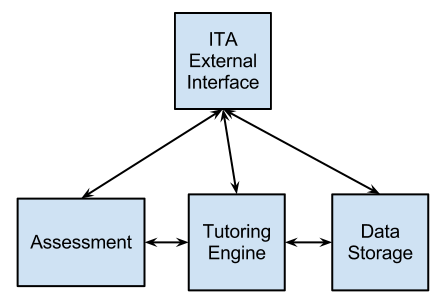
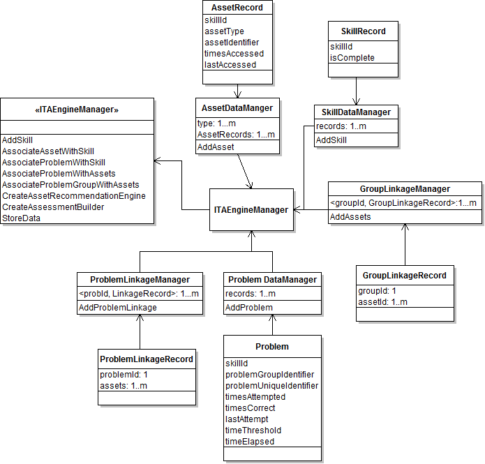
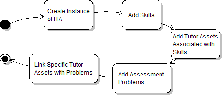
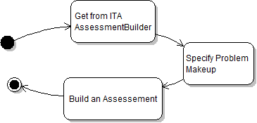
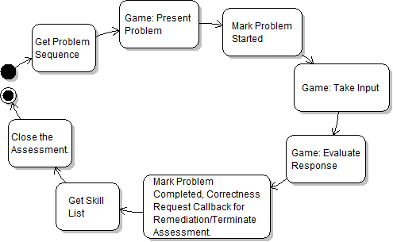
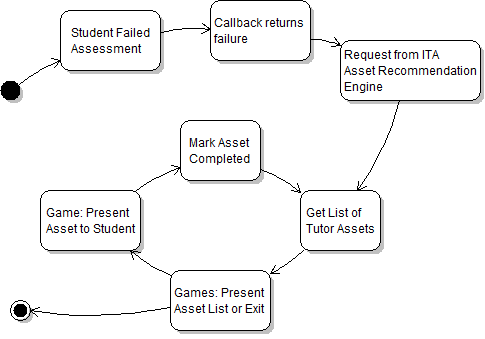

# ITA Engine

The ITA Prototype is the framework developed to incorporate intelligent instructional software into educational games. A Research & Development (R&D) goal
of the design is to create an extensible and generic software model and implementation of an intelligent tutor that can instruct students in different subject
matter domains (e.g., math, counseling) using different game platforms (e.g., Windows desktop computers, Mac OS X laptops).

This document describes how to use ISL ITAEngine software that is provided. The requirements, directory structure, build process, testing, and usage are covered. 

# Requirements

## Compiler - Mono/C\# ##

The library is written in C#. Mono is the environment used to build the software. This is the only piece of software that is required to be obtained and installed on the testing computer. The ITA is built and tested using the version of Mono that is released with Unity 3.5.x which is 2.6.x. This limits the use of C# .Net APIs to 3.5 and below. Unity's version of Mono also has some functionality removed. While the APIs distributed by Unity are limited, this will not affect the ability of a developer to use versions of Mono directly from the website. 

*   http://www.mono-project.com
*   [Mono 2.6.7](http://download.mono-project.com/archive/2.6.7/download/)

## Doxygen

Doxygen is the tool used to generate the documentation. A Windows executable of doxygen comes with the library. Versions for other operating systems can be obtained by going to the website and downloading it. The documentation for the library can be generated by double clicking the file `build-docs.bat`. 

http://www.doxygen.org

## Unity 3D

An example Unity3 project has been provided. It has been tested with Unity3D Pro version 3.5.6f4. The free version of Unity3D should be able to build and run the included project. 

http://www.unity3d.com

## Operating System

This software will build and run on environments that support Mono version 2.6.7. This includes Windows, Apple OS X, and various Linux distributions. However, it has only been tested on Windows 7. The build, test, and documenation scripts assume a Windows only environment. 

# Directory Structure

Below is a simplified version of the directory structure. The ITAEngine DLL is located at the top. There are some example and text applications in the apps directory. 

## Applications

The programs in this directory utilize the ITAEngine DLL. There are three applications and one DLL. 

### MorseCode

The MorseCode application is a console application that demonstrates the use of the ITAEngine. The use of the ITA is visible in the Main.cs file.

    +---apps
    |   +---MorseCode
    |   |   +---bin
    |   |   |   +---Debug
    |   |   |   +---Release
    |   |   +---data
    |   |   +---lib
    |   |   +---src

### Test Scripts

The test-scripts directory contains a program called SuccessAccess.exe. It is located in FuncTestRunner\bin. This program runs the functional tests contain in problems that are XML files. It relies on a DLL called TestScriptCommon.dll contained in the TestScriptCommon\bin\ directory. 

The SuccessAccess program can used as an example of how to use the ITAEngine. It goes through the procedures necessary for loading data, peforming an assessment, and tutoring. However, it does not provide the presentation of problems like the Morse Code applications. It's only concerned with the links between the data and using them. 

The DLL TestScriptCommon.dll is also used by the Unity Morse Miniaml sample applcation. This DLL could potentially be used as the basis for your own applications. It does have extra functionality that is not needed. 

    |   +---test-scripts
    |   |   +---FuncTestRunner
    |   |   |   +---bin
    |   |   |   |   +---Debug
    |   |   |   |   +---Release
    |   |   |   +---obj
    |   |   |       +---Debug
    |   |   |       +---Release
    |   |   +---problems
    |   |   +---TestScriptCommon
    |   |       +---bin
    |   |       |   +---Debug
    |   |       |   +---Release
    |   |       +---obj
    |   |       |   +---Debug
    |   |       |   +---Release
    |   |       +---src

### Unity Morse Minimal

The UnityMorseMinimal is the sample Unity app that demonstrates how to use the app with the Unity game engine. 

    |   +---UnityMorseMinimal
    |       +---Assets
    |       +---ProjectSettings

## Documentation

The doc directory contains this user guide as well as an API reference. The API reference is generated using Doxygen based on the information contained in the src directories for the entire library. 

    +---doc
    |   +---html
    |   |   +---search
    |   +---images
    |   +---latex
    |   +---uml
    |   +---UserGuide

## ITAEngine

The ITAEngine directory contains the source of the DLL. The generated DLL is contained in the bin directories. 

    +---ITAEngine
    |   +---src
    |       +---Callbacks
    |       +---Implementations
    |       |   +---Inner
    |       |   +---InnerInterfaces
    |       +---Structures

The unit tests are kept in ITAEngineUnitTests. These are in a separate project so that any app that uses ITAEngine.dll doesn't require the nunit.framework.dll. 

    +---ITAEngineUnitTests
        +---src
            +---tests
                +---Inner

## Logs

The logs directory contains the build, unit test, and functional test log.

    +---logs

# Build Process

## Creating ISL Software Builds 

Mono ships with a tool that will build solution files or csproj files. The tool is called xbuild.exe. Below are examples of building a Release and Debug configurations. The &ltbuild_file&gt refers to either a .sln or .csproj file. 

### Release Build

    xbuild /t:Build /p:Configuration=Release /p:CscToolExe=gmcs.bat &ltbuild_file&gt

### Debug Build

    xbuild /t:Build /p:Configuration=Debug /p:CscToolExe=gmcs.bat &ltbuild_file&gt

### Clean the Release files

    xbuild /t:Clean /p:Configuration=Release &ltbuild_file&gt

### Clean the Debug files

    xbuild /t:Clean /p:Configuration=Debug &ltbuild_file&gt

# Testing

There is a testing document the describes the test procedures. To run the tests, use run the batch files listed below.

*   run-tests-unit.bat
*   run-tests-func.bat

# Usage

## Basics

The ITAEngineManager is the central core of the ISL. It's where data is loaded in the ITA and how assessments and tutoring (asset recommendations) are generated. The diagram below shows a high level view of the central library. 



### Data Loading

The ITA doesn't not have non-volatile data storage mechanism. How that is acheived is up to the developer. The expectation is that the developer will retrieve the data necessary for loading into the ITA. The ITA does not manage the resources that will be presented to the user. The developer will need to manage those separately. The example applications in the apps directory provide an example of how to do that. 

#### Data Layout

Unique identifiers are required for all data items of the same type. The internal storage mechanism for identifiers is a string. 

The following is a notional data file layout that describes the data necessary to load data into the ITA. Note that information that would need to be presented to the student is not included. That data could be kept in the same file or in separate files depending on your needs. The morse code examples have two different data file layouts. In UnityMorseMinimal, there is a file called morsecode_data.xml. It contains all data needed in one file. In the MorseCode project, there is a data directory that contains two files that describe the data. 

```
problemGroup id="1" skills="1"
    problem id="1" timesAttempted="0" timeCorrect="0" lastAttempt="0" thresholdTime="0"
    problem id="2" timesAttempted="0" timeCorrect="0" lastAttempt="0" thresholdTime="0"
    problem id="3" timesAttempted="0" timeCorrect="0" lastAttempt="0" thresholdTime="0"
    problem id="4" timesAttempted="0" timeCorrect="0" lastAttempt="0" thresholdTime="0"

problemGroup id="2" skills="2,3"
    problem id="5" timesAttempted="0" timeCorrect="0" lastAttempt="0" thresholdTime="0"
    problem id="6" timesAttempted="0" timeCorrect="0" lastAttempt="0" thresholdTime="0"
    problem id="7" timesAttempted="0" timeCorrect="0" lastAttempt="0" thresholdTime="0"
    problem id="8" timesAttempted="0" timeCorrect="0" lastAttempt="0" thresholdTime="0"

skills
    skill id="1" isComplete="false"
        asset id="1" type="A" timesAccess="0" lastAccessed="0"
        asset id="2" type="B" timesAccess="0" lastAccessed="0"
    skill id="2" isComplete="false"
        asset id="3" type="B" timesAccess="0" lastAccessed="0"
        asset id="4" type="C" timesAccess="0" lastAccessed="0"
    skill id="3" isComplete="false"
        asset id="5" type="A" timesAccess="0" lastAccessed="0"
        asset id="6" type="C" timesAccess="0" lastAccessed="0"

groupLinkage
    problemGroup id="1" 
        asset id="1"
        asset id="2"
    problemGroup id="2"
        asset id="3"
        asset id="4"
        asset id="5"
        asset id="6"

problemLinkage
    problem id="1"
        asset id="1"
    problem id="5"
        asset id="3"
        asset id="6"
```

The following diagram presents the data layout from a class perspective. Unless you are modifying the library, it's not necessary that for you to have to understand how this works. 



#### Psuedocode

The following is pseudocode for initializing the ISL and loading data into it. 

    //Load Data from data file
    
    //Initialize ITAEngineManager
    ITAEngineManager ita =  new DefaultITAEngineManager();
     
    //Add Skills 
    foreach(skillid in skillList) {
        ita.AddSkill(skillid, isCorrect);
    }
    
    //Add Assets
    foreach(assetid in assetList) {
        ita.AssociateAssetWithSkill(skillid, type, id, 0, 0, 0);
    }
        
    //Associate Assessment Problems with Skill
    foreach (probId in probList) {
        ita.AssociateAssessmentProblemWithSkill(skillId, groupId, probId, 0, 0, 0);
    }
    
    //Associate Assessment Problems with Asset
    foreach (probId in probList){
        ita.AssociateProblemWithAssets(problemId, assets[]);
    }



### Assessment Creation

To create an Assessment, it needs to be built first. The AssessmentBuilder will create an Assessment based on criteria passed to it via the AddProblem method. The number of problems, problemGroup, and a randomization string are used. The final step is to build it. 

#### Psuedocode

    //Get AssessmentBuilder
    AssessmentBuild aBuild = ita.CreateAsssessmentBuilder();
    
    //Specify Problem Makeup
    aBuild.AddProblem(numberOfProblems, problemGroupId, "randomizationString");
    
    
    //Build Assessment
    Assessment assess = aBuild.Build();




### Assessment Processing

Assessment processing is the point at which the developer is ready to present problems to the student for answering. The developer gets the problem data marks it as started, presents it to the student, records the student's response, marks the problem as complete, checks for termination and ends the assessment. 

#### Psuedocode

    //Create AssessmentActionResponse object
    class ActionResponse : AssessmentActionResponse {
        //Implement interface.
    }
    
    class CompResp : AssessmentCompletionResponse {
        //Implement Interface
    }
    
    ActionResponse actResponse = new ActionResponse();
    
    //Get Problem Sequence
    probList = assess.GetProblemSequence();
    
    foreach (problId in probList) {
    
        //User Interface: Present problem to student 
        GUIPresentProb(probId);
    
        // Mark Problem Started
        assess.MarkStarted(probId);
        
        // UserInterface: Receive input from student
        GUIGetInput(probId)
        isCorrect = IsItCorrect(probId)
        
        //Mark Problem Completed
        assess.MarkCompleted(probId, isCorrect, actResponse);
        
        //Check Callback Action Response
        hasFailed = actResponse.HasFailed();
        if (hasFailed) {
            //Get Skill List
            skillList = assess.GetSkills();
            break;
        }
        if (actionResponse.HasFinished())
            break;
    }       
    
    //Close the Assessment.
    CompResp compResp = new CompResp();
    assess.Close(compResp);




### Recommendation Processing

After a student has failed a challenge the RecommendationEngine can be used to get a list of Assets. These can be used to aid the student in learning the material that was not understood. 

#### Psuedocode

    //Student has failed the Assessment
    //Callback in Assessment has returned failed.
    
    //Create AssetRecommendationEngine
    AssetRecommenationEngine are = ita.CreateAssetRecommendationEngine();
    
    //Get Recommenations for problem group
    List<AssetRecommendation> arList = are.GetRecommenationsFor(problemGroupId);
    
    foreach (assetRecomm in arList) {
        //Present to User
        GUIPresentAsset(assetRecomm.GetAssetIdentifier());
    
        //Mark Asset Completed
        assetRecomm.MarkAssetCompleted(assetRecomm.GetAssetIdentifier());
        
        //Repeat until finished or student has interrupted
    }




## Unity

To use the ITAEngine.dll with Unity, all that you need to do is drop the dll file into the Assets directory of your Unity project. Unity should automatically detect the dll and make the functionality available. 

The functionality can be accessed by including specifying the namespaces at the top of your C# source files 

    namespace ITAEngine;
    namespace ITAEngine.Inner;

### Unity Sample Morse Code 

The sample application was created using Unity 3.5. It can be converted using Unity 4.0. However, a GameObject will be missing. Create a new GameObject and drag the ApplicationClass.cs file up to the new GameObject. The game should now build and run. 

# Conclusion

You should now be ready to use the ISL ITAEngine DLL. There are several examples pieces of code that should help you get started. 

Copyright AT & LT, LLC 2012. All Rights Reserved. This document is licensed is as follow as long as copyright notification is left in place.

[](http://creativecommons.org/licenses/by-sa/3.0/deed.en_US)
This document is licensed under a [Creative Commons Attribution-ShareAlike 3.0 Unported License](http://creativecommons.org/licenses/by-sa/3.0/deed.en_US).
